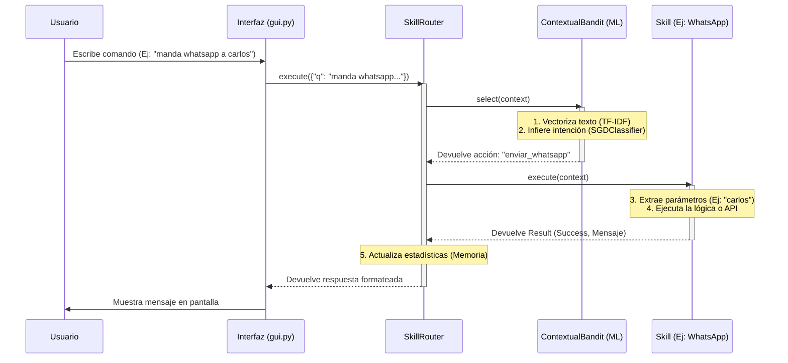

# Asistente Jarvis con Inteligencia Artificial

Este proyecto es un asistente virtual escalable inspirado en Jarvis, impulsado por una interfaz gráfica moderna (customtkinter) y un sistema de Machine Learning (scikit-learn) para la detección de intenciones.

## Flujo de Ejecución de la Arquitectura

La arquitectura está diseñada para ser altamente modular, aislando la predicción de la ejecución real. Aquí tienes el flujo exacto de cómo viajan los datos desde que escribes un mensaje hasta que la acción ocurre:



### Componentes del Flujo

1. **Interfaz Gráfica (`gui.py`)**: Atrapa la entrada del usuario de manera asíncrona para no congelar la pantalla, y le pasa la consulta en formato de "Contexto" (`{"q": texto}`) al Router.
2. **Enrutador (`agent/router.py`)**: Es el director de orquesta. Conoce todas las habilidades (skills) disponibles pero no sabe cuándo ejecutarlas. Le delega esa decisión al bandido/clasificador.
3. **Cerebro ML (`agent/bandit.py`)**: El modelo de `scikit-learn`. Traduce el lenguaje natural a comandos fijos que la programación puede entender. Además, es capaz de aprender sobre la marcha (Online Learning) con retroalimentación (feedback).
4. **Habilidades (`skills/`)**: Son módulos tontos y especializados. Reciben el texto original para buscar palabras clave (como a quién enviar el mensaje) y ejecutan la acción real (abrir web, crear archivo, etc.).

## Instalación y Uso

1. Instalar requerimientos: `pip install -r requirements.txt`
2. Ejecutar el asistente: `python demo.py`

## Datos y entrenamiento

Jarvis solo ejecuta una acción si el clasificador tiene al menos un 50 % de
confianza; si no, pregunta. Enviar WhatsApp, llamar o mandar notas de voz
siempre piden confirmación. Para mejorar el modelo:

```bash
python scripts/importar_massive.py        # descarga y adapta MASSIVE (español)
python scripts/evaluar.py --detalle       # mide aciertos / abstenciones / errores
python scripts/etiquetar_pendientes.py    # etiqueta las frases que no entendió
python demo.py --train                    # reentrena con todo lo anterior
```

Detalles de cada archivo en [data/README.md](data/README.md).
